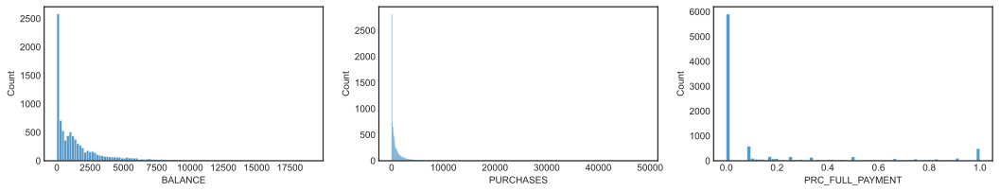

# CREDIT CARD CUSTOMER SEGMENTATION USING CLUSTERING ALGORITHM

Scikit-Learn Team Members :
1. Lidya Kurniawati Tjahja - [Email](lidyaktjahja@gmail.com) | [LinkedIn](https://www.linkedin.com/in/lidyaktjahja/)
2. Stefanus Ivan Laksono - [Email](stefanusivanlaksono@gmail.com) | [LinkedIn](https://www.linkedin.com/in/stefanusivanlaksono/)

Source : <a href="https://www.kaggle.com/arjunbhasin2013/ccdata">Credit Card Dataset for Clustering</a>

---

# I. Problem Statement
## 1. Background
Credit card business competition is very tight. Customers can easily switch to another credit card that has lower overall fees. According to <a href="https://www.dbmarketing.com/articles/Art175.htm">How to Retain a Credit Card Customer</a>, it costs about 80 dollars to get a new credit card customer who would returns about 120 dollars a year in profit to the company only if they keep the card. If he drops the card after a few weeks or doesn't use the card, the company will lose the customer acquisition cost (CAC) plus some more money when trying to reactivate them. In addition, Financial Publishing Services also state in their <a href="https://www.fpsc.com/The_Cost_of_Customer_Churn.pdfresearch">research</a> that CAC is estimated at five times the rate of retaining existing ones. It clearly shows that every credit card issuer must put their best effort to retain their customers. The right retention strategy can increase the company's chances of retaining its customers and further reduce the estimated loss that will be cover by the company. 

Customer loyalty is a key factor to keep . We can increase the loyalty of our customers by understanding their needs first. Personalization can give better results for customer retention

PWDK Bank is one of the credit card issuers in USA. Currently the company only has one type of credit card. In order to serve customers better, the company plan to release new types of credit card based on customer's needs. In this project, we position ourselves as part of the Data Scientist team at PWDK Bank. We were assigned to the marketing division to segment credit card users based on credit card usage in the last 6 months. 

The expected output of this project is a customer cluster based on current data and situation using ML. However, due to our time, budget, and data constraints, we limit the ability of our model in this project to predict outputs for clusters only, because more detailed information requires more data.
  
## 2. Business Objectives

The business objectives that we want to achieve through this project are as follows:
- Create credit card customer segmentations based on their credit card usage.
- Provide information and suggestion for credit card development based on customer segmentation result

## 3. Data Requirements

The target we set is customer segmentation based on their transaction behavior. The information needed to create a cluster is their transaction using a credit card in the past few months. For example, their credit limit, balance, purchases, one off purchases, installment purchases, payments, minimum payments, etc.

## 4. Analytic Approach
### Machine Learning Techniques
Since we don't know the cluster or the label yet then this problem can be addressed as Unsupervised Learning. Unsupervised learning here to be more specific is about clustering. We will enter the data into the program, then based on some algorithm the program will try to group it which will then return some data clusters. 

### Risk
There are two possible risks that may be caused by incorrect predictions of the ML model:
- The first scenario is when we group customers to a lower level when they should be in a higher cluster level. This can cause the bank to lose the opportunity to make a profit. i.e. if customers are at a higher level, they tend to spend more money which leads to company profits. Or, it can lead to customer churn if they see a competitor offering a better profit.
- The second scenario is when customers are grouped at a higher level when they should be at a lower level. This can cause the Bank to suffer losses if the customer cannot pay his credit card. Or it can lead the company to opportunity loss if the customers didn't use the money.

### Performance Measure
Performance measures for evaluating the ML model are WCSS (Within Cluster Sum of Squares) and silhouette scores.

---

# II. Data Understanding
We used <a href="https://www.kaggle.com/arjunbhasin2013/ccdata">Credit Card Dataset for Clustering</a> dataset in Kaggle. The dataset summarizes the usage behavior of 8950 credit card customers during the last 6 months. The file is at a customer level with 18 behavioral variables. The following is a display of the first five rows of the dataset.

CUST_ID | BALANCE | BALANCE_FREQUENCY | PURCHASES | ONEOFF_PURCHASES | INSTALLMENTS_PURCHASES | CASH_ADVANCE | PURCHASES_FREQUENCY | ONEOFF_PURCHASES_FREQUENCY | PURCHASES_INSTALLMENTS_FREQUENCY | CASH_ADVANCE_FREQUENCY | CASH_ADVANCE_TRX | PURCHASES_TRX | CREDIT_LIMIT | PAYMENTS | MINIMUM_PAYMENTS | PRC_FULL_PAYMENT | TENURE
-----|-----|-----|-----|-----|-----|-----|-----|-----|-----|-----|-----|-----|-----|-----|-----|-----|-----
C10001 | 40.900749 | 0.818182 | 95.4 | 0 | 95.4 | 0 | 0.166667 | 0 | 0.083333 | 0 | 0 | 2 | 1000 | 201.802084 | 139.509787 | 0 | 12
C10002 | 3202.467416 | 0.909091 | 0 | 0 | 0 | 6442.945483 | 0 | 0 | 0 | 0.25 | 4 | 0 | 7000 | 4103.032597 | 1072.340217 | 0.222222 | 12
C10003 | 2495.148862 | 1 | 773.17 | 773.17 | 0 | 0 | 1 | 1 | 0 | 0 | 0 | 12 | 7500 | 622.066742 | 627.284787 | 0 | 12
C10004 | 1666.670542 | 0.636364 | 1499 | 1499 | 0 | 205.788017 | 0.083333 | 0.083333 | 0 | 0.083333 | 1 | 1 | 7500 | 0 |  | 0 | 12
C10005 | 817.714335 | 1 | 16 | 16 | 0 | 0 | 0.083333 | 0.083333 | 0 | 0 | 0 | 1 | 1200 | 678.334763 | 244.791237 | 0 | 12

Below is the definition of each features:
- `CUST_ID` - Identification of credit card customer
- `BALANCE` - Balance amount left in their account to make purchases
- `BALANCE_FREQUENCY` - How frequently the balance is updated, score between 0 and 1 
  - 1 = frequently updated
  - 0 = not frequently updated
- `PURCHASES` - Amount of purchases made from account 
- `ONEOFF` - Maximum purchase amount done in one-go
- `INSTALLMENTS` - Amount of purchase done in installment
- `CASH_ADVANCE` - Cash in advance given by the user
- `PURCHASES_FREQUENCY` - How frequent the purchases are being made, score between 0 and 1
  - 1 = frequently updated
  - 0 = not frequently updated
- `ONEOFF_FREQUENCY` - How frequent purchases are happening in one-go
  - 1 = frequently updated
  - 0 = not frequently updated 
- `INSTALLMENTS_FREQUENCY` - How frequent purchases in installments are being done
  - 1 = frequently updated
  - 0 = not frequently updated 
- `CASH_ADVANCE_FREQUENCY` - How frequently the cash in advance being paid
- `CASH_ADVANCE_TRX` - Number of transactions made with cash in advance 
- `PURCHASES_TRX ` - Number of purchase transactions made 
- `CREDIT_LIMIT` - Limit of credit card for user
- `PAYMENTS` - Amount of payment done by user
- `MINIMUM_PAYMENTS` - Minimum amount of payments made by user
- `PRC_FULL_PAYMENT` - Percent of full payment paid by user
- `TENURE` - Tenure of credit card service for user

---

# III. Exploratory Data Analysis
## Data Distribution Plot
- Overall, each feature has right-skewed distribution because of the anomaly behaviors of the small proportion of customers. 
- Majority of customers have `BALANCE` value close to zero. It can be concluded that the company has many active customers
- Not many customers can make full payments on their credit card bills (the largest percentage of `PRC_FULL_PAYMENT` is on zero value)

[Boxplot BALANCE, PURCHASE, PRC_FULL_PAYMENTS]
## Data Correlation
- `PURCHASES` has strong positive relationship with `PURCHASES_FREQUENCY`, `PURCHASES_TRX`, `ONEOFF`, `INSTALLMENTS`, `ONEOFF_FREQUENCY`, and `INSTALLMENTS_FREQUENCY`. It shows that the high value of `PURCHASES` are influenced by the number of transactions and frequency. The `ONEOF

Besarnya pembelian yang dilakukan oleh credit card user dipengaruhi oleh jumlah transaksi dan frekuensinya. Nilai `PURCHASES` merupakan penjumlahan pembelian yang dilakukan baik secara `ONEOFF` maupun `INSTALLMENTS` sehingga ketiga variabel tersebut memiliki korelasi positif yang kuat.
- `CASH_ADVANCE` has strong positive relationship with `CASH_ADVANCE_FREQUENCY` and `CASH_ADVANCE_TRX`.
[Heatmap Spearman]
## Identify Missing Values, Duplicates, and Outlier 
- There is no duplicate on this dataset.
- There are 313 missing values on `MINIMUM_PAYMENTS` and 1 missing value on `CREDIT_LIMIT`.
- There are many outliers for each feature and we decided not to apply any process to them 

---

# IV. Data Preprocessing

## Remove Unnecessary Features
Based on the results of data understanding and exploratory data analysis, we decided not to use `CUST_ID` as input to the machine learning clustering model. `CUST_ID` has a unique value for each entry and does not provide any useful information for customer segmentation.  

## Missing Values Handling  
There are 313 missing values on `MINIMUM_PAYMENTS` and 1 missing value on `CREDIT_LIMIT`.
- Missing value in `CREDIT_LIMIT` column is dropped because there is only 1 data that has a null value.
- Missing values in `MINIMUM_PAYMENTS` are filled with zero when the corresponding row also has zero value on the`PAYMENTS`
- For customers whose `PAYMENTS` is not zero, we filled `MINIMUM_PAYMENTS` missing values to be the same as `PAYMENTS`

---

# V. Customer Segmentation Modeling and Analysis
In the modeling process we tried several base models to clusters

## Clustering Algorithms
For the modeling process, we used 3 clustering algorithms as below: 
- K-Means
- Agglomerative 
- Gaussian Mixture Models (GMM)

## Evaluation Metrics
The main evaluation metrics that we used are **Silhouette Score** and **WCSS (Within-Cluster Sum of Square)**. We can applied silhouette score to evaluate any clustering results and WCSS only to evaluate K-Means clustering results. Silhouette score values range from -1 to 1 and here is the interpretation of 1, 0, and -1.
- 1 : Means clusters are well apart from each other and distinguished
- 0 : Means clusters are indifferent, or we can say that the distance between clusters is not significant. 
- -1 : Means clusters are assigned in the wrong way

## Features Selection
We want to create clustering model that has high interpretability. We only focused on some features that have significant impact to the cluster results. by checking the importance of each features to each clusters.

1. Cluster the dataset using all features and evaluate the results of the clustering for each cluster algorithm
2. Select the optimal number of cluster for each cluster algorithm
3. Generate violinplot for each feature with the number of cluster selected and evaluate the potential significant features visually
4. Create a new dataset by adding the clustering result to the initial dataset
5. Split dataset into train and test by using clustering results column as a targets or labels
6. Train a classification machine learning model that has a feature_importances attribute (decision trees and random forest) with the train set
7. Predict the test set labels outcome with the selected classification machine learning model and make sure it has good evaluation score
8. Generate the feature_importances from the model and analyze it for each cluster algorithm

[Feature Importances Images]

Based on features selection results, we selected 3 features that have significant impact on defining credit card customers cluster:
- `CREDIT LIMIT`
- `BALANCE`
- `PAYMENTS`

## Cluster Results
1. K-Means
2. Agglomerative
3. Gaussian Mixture Models

## Cluster Analysis
Below is the **Clustering Visualization** result for the [Clustering Algorithm Selected]: 
[Scatter Matrix Images]
[PCA 2D Visualization]
[3D Visualization]

---
 
# VI. Recommendation

### REFERENCES 
https://www.dbmarketing.com/articles/Art175.htm

    
